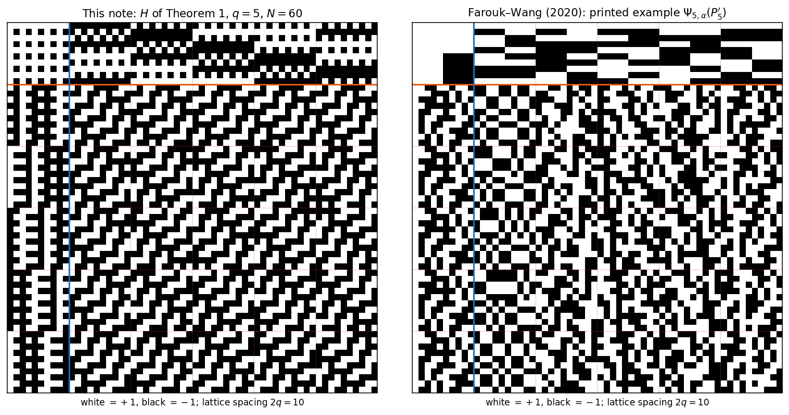

# p1mod4 — a Paley‑II analogue of the Scarpis/Đoković construction

An explicit, uniform construction of a **real Hadamard matrix of order
`N = 2·q·(q+1)`** for every prime power `q ≡ 1 (mod 4)`, built from the quadratic
character on `𝔽_q` and the `2×2` Paley‑II replacement blocks.

This is the Paley‑II counterpart of Scarpis's lift and of Đoković's prime‑power
extension for `q ≡ 3 (mod 4)` (which yields order `q(q+1)`); since the Paley‑II
seed has order `2(q+1)`, the natural Scarpis‑type target here is `q·2(q+1) = 2q(q+1)`.

> **Theorem.** Let `q ≡ 1 (mod 4)` be a prime power. Then there is a Hadamard
> matrix of order `2q(q+1)`.

> **What this repo contributes is the method, not a new existence result.**
> Both constructions are constructive; the difference is procedure versus
> formula: Farouk–Wang's lift takes choices (an input matrix, a bijection `α`)
> that can change the output — ours takes none, one matrix per `q`.
> The order‑`2q(q+1)` family was constructed by Farouk & Wang [FW2020] from
> the same order‑`2(q+1)` Paley‑II seed as a Scarpis/Đoković analogue, with a
> follow‑up in [FW2022]. Farouk–Wang lift an
> input Hadamard matrix of order `2(q+1)` (subject to eligibility conditions)
> and verify orthogonality by row‑pair counting arguments that import inner
> products from the input matrix's Hadamard property. Here there is no input
> matrix — the finite bands are given entrywise in closed form by the quadratic
> character composed with the Paley‑II blocks, and the Hadamard property is
> proved by four block‑Gram identities computed directly from character sums.
> The outputs differ too: **at `q = 5` the matrix constructed here is not
> Hadamard‑equivalent to the order‑`60` example printed in the appendix of
> [FW2020]** (the two matrices' row‑quadruple correlation multisets, an
> invariant of Hadamard equivalence, differ). Farouk–Wang note that their
> output may vary with a choice of bijection `α`, so this is inequivalence to
> their *published* example specifically. Whether the matrix here matches some
> other output of their procedure is open for `q > 5`; **at `q = 5` an
> unrefereed computation reports that it does** — see Remark 5 of the paper and
> `code/alpha_family.py`. That report is agent-produced and has not been
> refereed, but if it holds, the inequivalence above is to their printed
> representative rather than to their family. See
> [References](#references) below.

## What else is in the paper

Beyond the construction and the Farouk–Wang comparison:

- **§5 — what the construction needs.** Replacing the character by a function
  `δ` with `δ(0)=0` on a finite abelian group and the shift by an arbitrary
  array `T`, the result is Hadamard **iff** `δ` is of Paley type and `T` is a
  `(G,n;1)`-difference matrix. *The sufficiency half is not new* — Seberry
  (1980) and Nuñez Ponasso (Thm. 4.3.3) have it in greater generality, in the
  Butson setting and without commutativity. **What is new is the converse:**
  that both conditions are *forced*. The two corollaries (`n ≡ 1 mod 4`; a
  non-prime-power instance would yield a projective plane of non-prime-power
  order) rest on that direction.
- **§6 — over the Gaussian integers.** The Paley‑II blocks are the real `2×2`
  representation of the Gaussian units, so the construction factors through a
  Butson matrix `Γ ∈ BH(q(q+1), 4)` whose Turyn double is `H`. `Γ` is
  equivalent to an output of Sargent–Lee–Rushall (2024), which with the same
  doubling gives a second literature route to the existence statement.
- **§7 — open problems.** Five, mostly one slot or the other of §5: how many
  Hadamard classes the `T`-slot produces as it ranges over all difference
  matrices (unanswered even at `n = 9`); whether `δ` is always unique up to
  `Aut(G)`; where the obstruction sits beyond the prime powers (the `δ`-slot
  *is* available at `n = 5625`, the `T`-slot is not, so the whole obstruction
  is in `T`); the `q ≡ 3 (mod 4)` class; and equivalence to the rest of the
  Farouk–Wang family — the last of which is now answered at `q = 5` by the
  unrefereed Remark 5, and open beyond it.
- **Appendix A — coverage.** Which orders in the family are already known
  Hadamard orders, an explicit witness where one exists, the first unaudited
  order (`q = 81`), a second worked example (`q = 109`), and a screen over
  `q ≤ 3000`.

## Scorecard

_`repo-rank` pass, commit `5cb92e7`, run 2026-07-27 — four independent cold
graders, each shown only its own axis — with the notes revised after the
follow-up work of Scorecard 003's addendum. Qualitative notes only._ Per-axis
reasoning, the confirmed findings, the open items and what would move each axis
are in [`AUDIT_LEDGER.md`](AUDIT_LEDGER.md), Scorecard 003 and its addendum.

| Axis | Note |
|---|---|
| Novelty | The weakest axis, and it moved **down** this round. Existence at these orders is Farouk–Wang's; §5's *sufficiency* half is prior art (Seberry; Nuñez Ponasso, whose dissertation also reaches the existence statement); §6's Γ is conceded equivalent to a Sargent–Lee–Rushall output. The `q = 5` inequivalence used to support the claim that this construction yields a *different object* — an unrefereed computation (Remark 5) now reports it is equivalent to an output of their procedure after all, which removes that support. What is left, and what no grader could locate, is §5's **converse**. |
| Depth | The strongest axis. Every theorem and corollary proved outright, nothing conditional, nothing carried by numerics. A grader working *only from the paper's text* — not from the code — reimplemented the construction and got exact Hadamard matrices at q = 5, 9, 13, 17, 25, so the prose determines the object. The quadruple-statistic invariance, previously used in three places without proof, is now Lemma 5. Still asserted rather than proved: that Γ is equivalent to a Sargent–Lee–Rushall output. |
| Reach | Settles the question §5 poses and gives a proved, quantitative delimitation — the entire non-prime-power obstruction is localised to the `T`-slot, the smallest conceivable instance pinned at order 63,292,500, Bruck–Ryser explicitly ruled out. It partially answers a published Farouk–Wang open problem, and §7 problem 5 is now answered at `q = 5` — though the answer is negative for this work, which is why the axis did not move. It reaches **no** currently-open Hadamard order, and could not: that cap is prior art, not arithmetic. |
| Evidence | The most improved axis. Every script runs, reproduces its published numbers, and leaves the tree clean; the fast profile routine is genuinely validated against a direct O(n⁴) reference before being trusted at scale, and all 104 rows of the coverage screen match the paper's printed table. The two gaps found last round are closed: the 6-of-16 Paley-type count is scripted, and the transcribed external table now carries an integrity check that catches compensating edits. |

## Ours vs. Farouk–Wang at q = 5



The two are visibly different constructions: ours (left) has a cap band of
period‑2 column patterns and finite bands with the diagonal texture of the
shifts `ψ(χ(y−x−ar))`; Farouk–Wang's printed example (right) has a coarse
tiled top band (its border block is four constant `5×5` quadrants) and no
diagonal structure. The inequivalence is not just visual: the multiset of
`|Σ_c h_ic·h_jc·h_kc·h_lc|` over all C(60,4) = 487,635 row quadruples — which
is invariant under row/column permutations and negations — contains the value
`28` on 400 quadruples for their matrix and on none for ours (and the
comparison fails in both orientations, covering the transpose convention).

## The construction at a glance

`H` is a stack of one **cap band** `M∞` over `q` **finite bands** `M_r`:

```
H = [ M∞ ;  M_r  (r ∈ 𝔽_q) ],     M_r = [ B_r | K_{ar} (a ∈ 𝔽_q) ]
```

- `K_t` is a `2q×2q` matrix of shifted Paley‑II blocks, `K_t[x,y] = ψ(χ(y−x−t))`.
- `B_r` is a rank‑two **border block** whose `2q·𝓡`/`−2𝓡` Gram contribution
  cancels the repeated‑row defect of the `K_{ar}` family.
- `M∞` is built from the order‑`2(q+1)` Paley‑II matrix, with finite column pairs
  right‑multiplied by `R = [[0,−1],[1,0]]` (the identity `ZR = −P` forces the cap
  rows orthogonal to every finite band).

The whole proof is a set of block‑Gram identities; `HHᵀ = 2q(q+1)·I`.

The colored regions below are exactly these pieces for the smallest case `q = 5`
(order `60`):


## How to use this repository

This repository was written with substantial assistance from large language
models and is designed, in part, for other language models to ingest. The
intended workflow is:

1. Give an AI agent access to the repository.
2. Ask it to trace definitions, proofs, computations, and dependencies across
   the paper, the verification code, and the audit records.
3. Interrogate its answers as a human reader—request derivations, file
   references, counterexamples, assumptions, and supporting evidence.

The paper's proofs occupy a space somewhere between prose and source code: the
four block‑Gram lemmas in `paper/main.tex` are structured
precisely enough for an agent to navigate and analyze, while remaining
readable by humans. They should not be treated as an automatic guarantee of
correctness; the repository includes an audit record (`AUDIT_LEDGER.md`) and
reproducibility checks (everything in `code/`) so that claims can be examined rather
than merely accepted.

### Ask your agent

Point your agent to this repository and try questions such as:

- What are the main claims, and which are proved here, computed here, or taken
  from the cited literature?
- Trace the proof of Theorem 1 through the four lemmas: where exactly does
  `χ(−1) = 1` enter, and what fails for `q ≡ 3 (mod 4)`?
- How does this construction differ from Farouk–Wang's, and where is that
  comparison audited?
- Rebuild the `q = 5` inequivalence evidence from `code/q5_equivalence/` and check
  the 4‑profile computation independently.
- Run the verification sweep in `code/ps_p1mod4.py` and say what passes and what
  those checks actually establish.
- What are the strongest unresolved limitations (for example, what remains
  open about equivalence to other outputs of the Farouk–Wang procedure)?

For important conclusions, ask the agent to cite exact files, lemma labels,
and line numbers—and verify the answer against the underlying source.

### Run it yourself

**What to run first** — verify the default sweep (`q = 5,9,13,17,25,29,37,41,49`)
against a full Gram check:

```bash
cd code && python ps_p1mod4.py
```

This prints `ALL PASS` (exit code `0`) if every case in the sweep satisfies
`HHᵀ = N·I`.

**Layout:**

- `paper/` — `main.tex` / `main.pdf`, the write‑up: the proof, the Farouk–Wang
  comparison, §5–§6, and the coverage analysis. `paper/images/` holds the
  figures shown above (`q5_side_by_side.png`, `structure_q5_N60.png`) plus
  per‑order `H`|Gram figures for `q = 5, 9, 13`, regenerable with `--figures`
  below.
- `code/` — all verification code; see [`code/README.md`](code/README.md) for
  the per‑script table.
  - `ps_p1mod4.py` — the construction, a small finite‑field layer (so extension
    fields such as `q = 9, 25, 49, 81, 125` work), the verification routines,
    and the figure/matrix export code.
  - `coverage_table.py` — Appendix A: the audited range, the
    elementary‑witness screen (232 orders, 128 covered, 104 without a witness),
    and the smallest failure `q = 109`.
  - `nearfield_q9.py` — Remark 11: the `q = 9` Dickson‑nearfield matrix of
    order 180 and its inequivalence to the matrix of Theorem 1.
  - `gaussian_c30.py` — Theorem 3 and Remark 13: `Γ ∈ BH(30,4)`, the check that
    `φ(Γ)` is the order‑60 matrix entrywise, and inequivalence to `C₃₀ + iI`.
  - `q5_equivalence/` — the `q = 5` comparison against Farouk–Wang's printed
    order‑60 example, with a positive control.
- `AUDIT_LEDGER.md` — the per‑claim audit record: what was checked, by what
  evidence, and what remains open.

**Reproducing the verification:**

```bash
cd code
python ps_p1mod4.py                                 # default sweep, full Gram
python ps_p1mod4.py --q 81 --sampled --pairs 5000    # headline order 13284
python ps_p1mod4.py --big                            # add q=81 to the sweep
```

- **Full Gram** `HHᵀ = N·I` for `N < 5000` (q ≤ 49), checked entrywise.
- **Streamed, sampled** row‑orthogonality for larger orders, without
  materializing the `N×N` Gram (used for `q = 81` → `13284` and `q = 125` →
  `31500`). Pass `--sampled`/`--full` to force a mode, `--pairs` to set the
  sample size.

All default cases pass; `q = 9, 25, 49` exercise the extension‑field path.

**Reproducing the figures:**

```bash
cd code && python ps_p1mod4.py --figures ../paper/images --figq 5,9,13   # structure + per-order H|Gram figures
```

**Exporting a matrix** (e.g. to inspect or compare against another
construction's output):

```bash
cd code && python ps_p1mod4.py --q 5 --write - --which H --fmt signs   # H to stdout, compact +/- form
```

`--which` selects `H` (the order‑`N` Hadamard matrix, default) or `seed` (the
order‑`2(q+1)` Paley‑II seed `S`); `--fmt` selects `ints` (space‑separated
`+1`/`-1`, default) or `signs` (compact `+`/`-` characters).

**Reproducing the paper's other numeric claims** — each script re-derives the
published numbers and exits nonzero if any disagrees:

```bash
cd code
python coverage_table.py            # Appendix A: 232 / 128 / 104, smallest failure q=109
python coverage_table.py --table    # ...and print the 104 orders without a witness
python nearfield_q9.py              # Remark 11: 44 attained on 112,752 quadruples vs none
python gaussian_c30.py              # Theorem 3 + Remark 13: 500 on 240 quadruples vs none
```

`nearfield_q9.py` covers all `C(180,4) = 42,296,805` row quadruples (about 8
seconds); it validates its vectorized profile routine against a direct
`O(n⁴)` reference at order 60, and against the recorded `q = 5` profile, before
using it at order 180.

**Requirements:**

- Python 3, `numpy` (verification) and `matplotlib` (figures only).
- The figure import is lazy, so verification needs `numpy` alone.

## Coverage

Because `q ≡ 1 (mod 4)`, every order factors as `2q(q+1) = 4·q·(q+1)/2` with both
`q` and `(q+1)/2` **odd** — i.e. the order is always `4×(odd)`. Consequently:

- the odd part is always composite — but that is a structural description, **not**
  an exclusion: of the 195 odd `m ≤ 2999` with no known Hadamard matrix of order
  `4m` (Cati–Pasechnik, Table 4), 71 are composite, so the check has to be made
  value by value rather than inferred;
- made value by value, it passes: every order whose odd part is `≤ 3000` is
  already a known Hadamard order — the twelve odd parts arising for `q ≤ 73` are
  each absent from that table — and the
  first instance beyond that audited range, `q = 81` (order `13284 = 4·41·81`), is
  covered by a classical **Turyn product** using `T`‑matrices of order `41` with
  Williamson‑type matrices of order `81 = 9²`.

The accompanying note
[`paper/main.tex`](paper/main.tex) gives the proof, a
coverage table for orders with odd part `≤ 3000`, the `q = 81` witness, and a list
of orders up to `q = 2917` for which no elementary construction is presently
evident (these are *unaudited*, not open).

## How to cite

If you reference this work, please cite the repository:

```bibtex
@misc{kline2026p1mod4,
  author       = {Kline, Jeffery},
  title        = {{A Paley--II analogue of the Scarpis--\DJ okovi\'c construction for prime powers $q \equiv 1 \pmod 4$}},
  year         = {2026},
  howpublished = {\url{https://github.com/jeff-kline/p1mod4}},
  note         = {GitHub repository}
}
```

Plain text: Jeffery Kline, *A Paley–II analogue of the Scarpis–Đoković
construction for prime powers q ≡ 1 (mod 4)*, 2026.
https://github.com/jeff-kline/p1mod4

For a reproducible reference, pin a specific commit hash or a tagged release in
the `note` field.

## References

- [FW2020] A. Farouk and Q.-W. Wang, *An infinite family of Hadamard matrices
  constructed from Paley type matrices*, Filomat **34** (2020), no. 3, 815–834.
  DOI: [10.2298/FIL2003815F](https://doi.org/10.2298/FIL2003815F)
- [FW2022] A. Farouk and Q.-W. Wang, *Construction of new Hadamard matrices
  using known Hadamard matrices*, Filomat **36** (2022), no. 6, 2025–2042.
  DOI: [10.2298/FIL2206025F](https://doi.org/10.2298/FIL2206025F)

(Full bibliography, including Scarpis, Đoković, Paley, and Turyn, is in
[`paper/main.tex`](paper/main.tex).)
