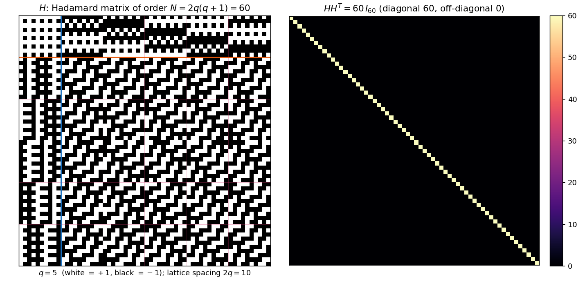
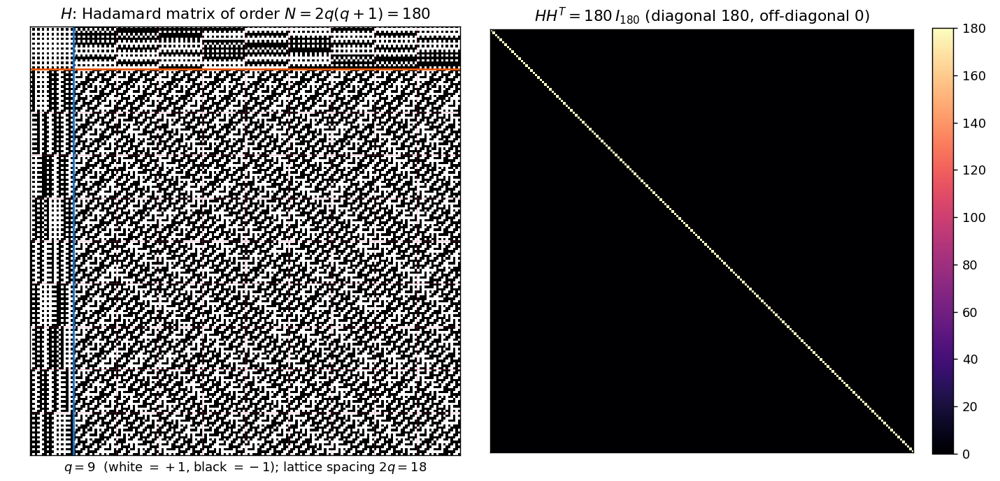
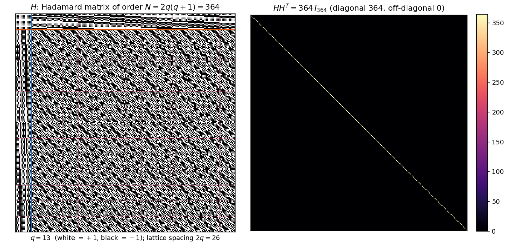

# p1mod4 — a Paley‑II analogue of the Scarpis/Đoković construction

An explicit, uniform construction of a **real Hadamard matrix of order
`N = 2·q·(q+1)`** for every prime power `q ≡ 1 (mod 4)`, built from the quadratic
character on `𝔽_q` and the `2×2` Paley‑II replacement blocks.

This is the Paley‑II counterpart of Scarpis's lift and of Đoković's prime‑power
extension for `q ≡ 3 (mod 4)` (which yields order `q(q+1)`); since the Paley‑II
seed has order `2(q+1)`, the natural Scarpis‑type target here is `q·2(q+1) = 2q(q+1)`.

> **Theorem.** Let `q ≡ 1 (mod 4)` be a prime power. Then there is a Hadamard
> matrix of order `2q(q+1)`.

## The construction at a glance

`H` is a stack of one **cap band** `M∞` over `q` **finite bands** `M_r`:

```
H = [ M∞ ;  M_r  (r ∈ 𝔽_q) ],     M_r = [ B_r | K_{ar} (a ∈ 𝔽_q) ]
```

- `K_t` is a `2q×2q` matrix of shifted Paley‑II blocks, `K_t[x,y] = ψ(χ(y−x−t))`.
- `B_r` is a rank‑two **border block** whose `2q·𝓡`/`−2𝓡` Gram contribution
  cancels the repeated‑row defect of the `K_{ar}` family.
- `M∞` is built from the order‑`2(q+1)` Paley‑II matrix, with finite column pairs
  right‑multiplied by `R = [[0,−1],[1,0]]` (the identity `ZR = −P` forces the cap
  rows orthogonal to every finite band).

The whole proof is a set of block‑Gram identities; `HHᵀ = 2q(q+1)·I`.

The colored regions below are exactly these pieces for the smallest case `q = 5`
(order `60`):


## Examples (small orders)

Left: the Hadamard matrix `H` (white `= +1`, black `= −1`), with the cap/finite
separator (orange) and border/`K` separator (blue). Right: the Gram matrix
`HHᵀ`, which is exactly `N·I` — diagonal `N`, off‑diagonal `0`.

**`q = 5`, order `60`:**


**`q = 9 = 3²`, order `180`** (an extension field — needs genuine `𝔽_9` arithmetic):


**`q = 13`, order `364`:**


## Verification

`ps_p1mod4.py` builds the matrices directly over `𝔽_q` (a small finite‑field layer,
so extension fields such as `q = 9, 25, 49, 81, 125` work) and checks the Hadamard
property two ways:

- **Full Gram** `HHᵀ = N·I` for `N < 5000` (q ≤ 49), checked entrywise.
- **Streamed, sampled** row‑orthogonality for larger orders, without materializing
  the `N×N` Gram (used for `q = 81` → `13284` and `q = 125` → `31500`).

```bash
python ps_p1mod4.py                 # default sweep: q = 5,9,13,17,25,29,37,41,49 (full Gram)
python ps_p1mod4.py --q 81 --sampled --pairs 5000   # headline order 13284
python ps_p1mod4.py --big           # add q=81 to the sweep
python ps_p1mod4.py --figures images --figq 5,9,13  # regenerate the PNGs above
```

All default cases pass; `q = 9, 25, 49` exercise the extension‑field path.

## Requirements

- Python 3, `numpy` (verification) and `matplotlib` (figures only).
- The figure import is lazy, so verification needs `numpy` alone.

## Notes on novelty (honest framing)

Because `q ≡ 1 (mod 4)`, every order factors as `2q(q+1) = 4·q·(q+1)/2` with both
`q` and `(q+1)/2` **odd** — i.e. the order is always `4×(odd)`. Consequently:

- the family never meets the open Hadamard orders (those are `4×prime`; here the
  odd part is always composite), so it resolves **no** open existence case;
- every order whose odd part is `≤ 3000` is already a known Hadamard order, and the
  first instance beyond that audited range, `q = 81` (order `13284 = 4·41·81`), is a
  classical **Turyn product** of `T`‑matrices of order `41` with Williamson‑type
  matrices of order `81 = 9²`.

The contribution is therefore **uniformity** — one closed‑form rule for the whole
`4×odd` family `2q(q+1)` — rather than new orders. The accompanying note
[`paley_scarpis_p1mod4_v2.tex`](paley_scarpis_p1mod4_v2.tex) gives the proof, a
coverage table for orders with odd part `≤ 3000`, the `q = 81` witness, and a list
of orders up to `q = 2917` for which no elementary construction is presently
evident (these are *unaudited*, not open).

## Files

- `ps_p1mod4.py` — construction, finite‑field layer, verification, and figure output.
- `paley_scarpis_p1mod4_v2.tex` / `.pdf` — the write‑up (construction + coverage analysis).
- `images/` — the PNGs shown above.
