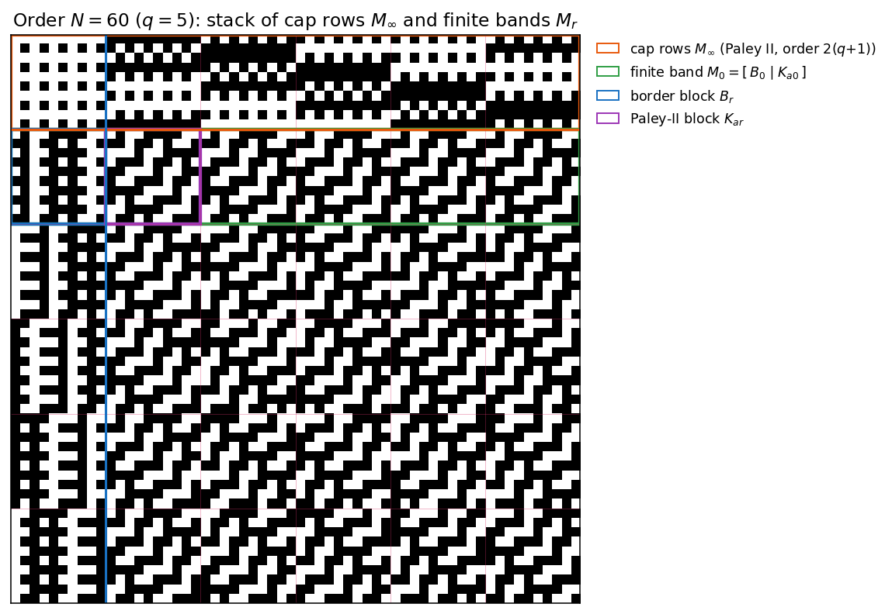

# p1mod4 — a Paley‑II analogue of the Scarpis/Đoković construction

An explicit, uniform construction of a **real Hadamard matrix of order
`N = 2·q·(q+1)`** for every prime power `q ≡ 1 (mod 4)`, built from the quadratic
character on `𝔽_q` and the `2×2` Paley‑II replacement blocks.

This is the Paley‑II counterpart of Scarpis's lift and of Đoković's prime‑power
extension for `q ≡ 3 (mod 4)` (which yields order `q(q+1)`); since the Paley‑II
seed has order `2(q+1)`, the natural Scarpis‑type target here is `q·2(q+1) = 2q(q+1)`.

> **Theorem.** Let `q ≡ 1 (mod 4)` be a prime power. Then there is a Hadamard
> matrix of order `2q(q+1)`.

> **What this repo contributes is the method, not a new existence result.**
> The order‑`2q(q+1)` family was constructed by Farouk & Wang [FW2020] from
> the same order‑`2(q+1)` Paley‑II seed as a Scarpis/Đoković analogue, with a
> follow‑up in [FW2022]. Farouk–Wang lift an
> input Hadamard matrix of order `2(q+1)` (subject to eligibility conditions)
> and verify orthogonality by row‑pair counting arguments that import inner
> products from the input matrix's Hadamard property. Here there is no input
> matrix — the finite bands are given entrywise in closed form by the quadratic
> character composed with the Paley‑II blocks, and the Hadamard property is
> proved by four block‑Gram identities computed directly from character sums.
> The outputs differ too: **at `q = 5` the matrix constructed here is not
> Hadamard‑equivalent to the order‑`60` example printed in the appendix of
> [FW2020]** (the two matrices' row‑quadruple correlation multisets, an
> invariant of Hadamard equivalence, differ). Farouk–Wang note that their
> output may vary with a choice of bijection `α`, so this is inequivalence to
> their *published* example specifically — whether the matrix here matches
> some other output of their procedure is left open. See
> [References](#references) below.

## Ours vs. Farouk–Wang at q = 5


The two are visibly different constructions: ours (left) has a cap band of
period‑2 column patterns and finite bands with the diagonal texture of the
shifts `ψ(χ(y−x−ar))`; Farouk–Wang's printed example (right) has a coarse
tiled top band (its border block is four constant `5×5` quadrants) and no
diagonal structure. The inequivalence is not just visual: the multiset of
`|Σ_c h_ic·h_jc·h_kc·h_lc|` over all C(60,4) = 487,635 row quadruples — which
is invariant under row/column permutations and negations — contains the value
`28` on 400 quadruples for their matrix and on none for ours (and the
comparison fails in both orientations, covering the transpose convention).

## The construction at a glance

`H` is a stack of one **cap band** `M∞` over `q` **finite bands** `M_r`:

```
H = [ M∞ ;  M_r  (r ∈ 𝔽_q) ],     M_r = [ B_r | K_{ar} (a ∈ 𝔽_q) ]
```

- `K_t` is a `2q×2q` matrix of shifted Paley‑II blocks, `K_t[x,y] = ψ(χ(y−x−t))`.
- `B_r` is a rank‑two **border block** whose `2q·𝓡`/`−2𝓡` Gram contribution
  cancels the repeated‑row defect of the `K_{ar}` family.
- `M∞` is built from the order‑`2(q+1)` Paley‑II matrix, with finite column pairs
  right‑multiplied by `R = [[0,−1],[1,0]]` (the identity `ZR = −P` forces the cap
  rows orthogonal to every finite band).

The whole proof is a set of block‑Gram identities; `HHᵀ = 2q(q+1)·I`.

The colored regions below are exactly these pieces for the smallest case `q = 5`
(order `60`):



## How to use this repo

**What to run first** — verify the default sweep (`q = 5,9,13,17,25,29,37,41,49`)
against a full Gram check:

```bash
python ps_p1mod4.py
```

This prints `ALL PASS` (exit code `0`) if every case in the sweep satisfies
`HHᵀ = N·I`.

**What's here:**

- `ps_p1mod4.py` — the construction, a small finite‑field layer (so extension
  fields such as `q = 9, 25, 49, 81, 125` work), the verification routines, and
  the figure/matrix export code. Everything below is a flag on this one script.
- `paley_scarpis_p1mod4_v2.tex` / `.pdf` — the write‑up: the proof, the coverage
  analysis, and the novelty discussion summarized above.
- `images/` — the figures shown above (`q5_side_by_side.png`,
  `structure_q5_N60.png`) plus per‑order `H`|Gram figures for `q = 5, 9, 13`
  (`H_q5_N60.png`, `H_q9_N180.png`, `H_q13_N364.png`), regenerable with
  `--figures` below.

**Reproducing the verification:**

```bash
python ps_p1mod4.py                                 # default sweep, full Gram
python ps_p1mod4.py --q 81 --sampled --pairs 5000    # headline order 13284
python ps_p1mod4.py --big                            # add q=81 to the sweep
```

- **Full Gram** `HHᵀ = N·I` for `N < 5000` (q ≤ 49), checked entrywise.
- **Streamed, sampled** row‑orthogonality for larger orders, without
  materializing the `N×N` Gram (used for `q = 81` → `13284` and `q = 125` →
  `31500`). Pass `--sampled`/`--full` to force a mode, `--pairs` to set the
  sample size.

All default cases pass; `q = 9, 25, 49` exercise the extension‑field path.

**Reproducing the figures:**

```bash
python ps_p1mod4.py --figures images --figq 5,9,13   # structure + per-order H|Gram figures
```

**Exporting a matrix** (e.g. to inspect or compare against another
construction's output):

```bash
python ps_p1mod4.py --q 5 --write - --which H --fmt signs   # H to stdout, compact +/- form
```

`--which` selects `H` (the order‑`N` Hadamard matrix, default) or `seed` (the
order‑`2(q+1)` Paley‑II seed `S`); `--fmt` selects `ints` (space‑separated
`+1`/`-1`, default) or `signs` (compact `+`/`-` characters).

**Requirements:**

- Python 3, `numpy` (verification) and `matplotlib` (figures only).
- The figure import is lazy, so verification needs `numpy` alone.

## Notes on novelty (honest framing)

Because `q ≡ 1 (mod 4)`, every order factors as `2q(q+1) = 4·q·(q+1)/2` with both
`q` and `(q+1)/2` **odd** — i.e. the order is always `4×(odd)`. Consequently:

- the family never meets the dominant open Hadamard orders of the form `4×prime`;
  here the odd part is always composite, so it resolves no case from that list;
- every order whose odd part is `≤ 3000` is already a known Hadamard order, and the
  first instance beyond that audited range, `q = 81` (order `13284 = 4·41·81`), is
  covered by a classical **Turyn product** using `T`‑matrices of order `41` with
  Williamson‑type matrices of order `81 = 9²`.

**The order‑`2q(q+1)` existence result is already in the literature** — Farouk &
Wang [FW2020, FW2022], from the same Paley‑II seed. What this repo adds is the
*method*: a closed‑form, input‑free construction (no input Hadamard matrix to
lift) with a self‑contained character‑sum block‑Gram proof, in place of
Farouk–Wang's eligibility‑conditioned lift and row‑pair counting argument — plus
the coverage analysis, which has no counterpart in [FW2020, FW2022]. The two
constructions also produce different outputs: at `q = 5` the matrix built here
is not Hadamard‑equivalent to the order‑`60` example printed in [FW2020]'s
appendix — see the side‑by‑side comparison at the top of this page (caveat: their output may vary with a choice of bijection `α`, so this is
inequivalence to their published example, not a claim about every output their
procedure could produce). None of this is a new existence result or a
resolution of any open order. The accompanying note
[`paley_scarpis_p1mod4_v2.tex`](paley_scarpis_p1mod4_v2.tex) gives the proof, a
coverage table for orders with odd part `≤ 3000`, the `q = 81` witness, and a list
of orders up to `q = 2917` for which no elementary construction is presently
evident (these are *unaudited*, not open).

## How to cite

If you reference this work, please cite the repository:

```bibtex
@misc{kline2026p1mod4,
  author       = {Kline, Jeffery},
  title        = {{A Paley--II analogue of the Scarpis--\DJ okovi\'c construction for prime powers $q \equiv 1 \pmod 4$}},
  year         = {2026},
  howpublished = {\url{https://github.com/jeff-kline/p1mod4}},
  note         = {GitHub repository}
}
```

Plain text: Jeffery Kline, *A Paley–II analogue of the Scarpis–Đoković
construction for prime powers q ≡ 1 (mod 4)*, 2026.
https://github.com/jeff-kline/p1mod4

For a reproducible reference, pin a specific commit hash or a tagged release in
the `note` field.

## References

- [FW2020] A. Farouk and Q.-W. Wang, *An infinite family of Hadamard matrices
  constructed from Paley type matrices*, Filomat **34** (2020), no. 3, 815–834.
  DOI: [10.2298/FIL2003815F](https://doi.org/10.2298/FIL2003815F)
- [FW2022] A. Farouk and Q.-W. Wang, *Construction of new Hadamard matrices
  using known Hadamard matrices*, Filomat **36** (2022), no. 6, 2025–2042.
  DOI: [10.2298/FIL2206025F](https://doi.org/10.2298/FIL2206025F)

(Full bibliography, including Scarpis, Đoković, Paley, and Turyn, is in
[`paley_scarpis_p1mod4_v2.tex`](paley_scarpis_p1mod4_v2.tex).)
